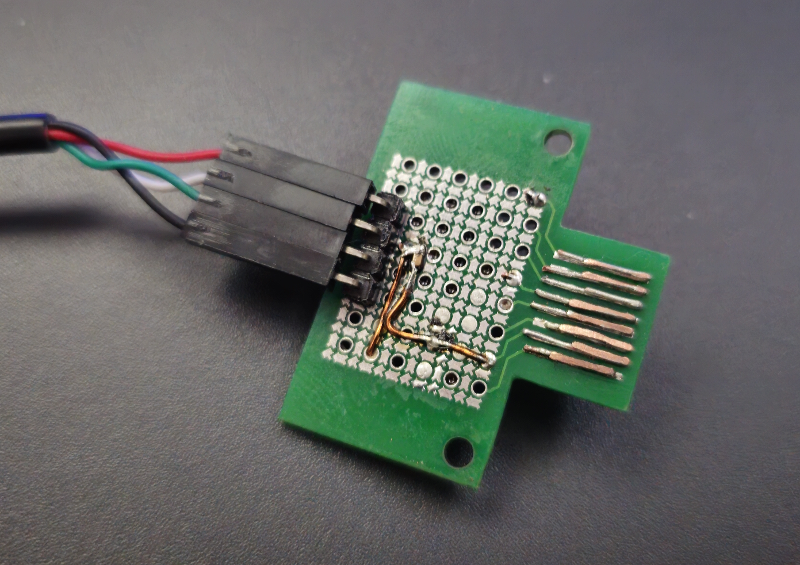

:toc:
:toclevels: 2

[discrete]
= DIY PSX SIO Adaptors/Connectors

This repository contains 3D models and PCB footprints/layouts for making your own connectors suitable for interfacing with the serial port (SIO) of Playstation 1 consoles. This port uses a proprietary connector and no off-the-shelf options are currently available. As a result, we have to DIY our own connectors, a number of options for which are documented here.

== Cheapest, hackiest option (If you have (but dont want to butcher) a link cable) - aka the 'SOIC port'

image::img/20250620_124839.jpg[alt="two SOIC adaptors cut into the correct shape with contacts and pin headers, ready for use",width=400, link=https://github.com/stephenwhittle/psx_sio_connectors/blob/main/img/20250620_124839.jpg]

The pin spacing of the contacts in this connector, as best I can tell, is 1.24mm and pads are approx 0.62mm wide. 
As a result, any SOIC-16 to DIP adaptor PCB can be cut down to size. SOIC leads have a 1.27mm pitch, but across 8 contacts there won't be enough accumulated drift to result in pins shorting out or making contact incorrectly.

Note, when making the vertical cuts on this image, you may wish to leave a little extra FR4 there and then file the sides down to ensure a snug fit and easy alignment of contacts once they are soldered on.

Solder some 0.5mm diameter wire across each of the pairs of contacts, or alternatively use some pins pulled from vertical 0.1" headers, a much easier option as the square profile of those pins will stop them rolling around as you solder. The fact that the pins won't roll around so much also makes it trivial to just reflow the board with  a hotplate if you have one.

Once you have soldered the wires or pins, place a small piece of Kapton or other tape on the underside to avoid shorting across the metal body of the cable, and solder some 0.1" right-angle header pins to the 8 remaining plated through-holes, and you are ready to go.

It's worth pointing out that this relies on the fact that the link cable has embedded spring contacts, so we don't need to worry too much about getting enough height out of the impromptu contacts we've soldered onto the PCB. However we do need to use wire thats at least 0.5mm thick to ensure that the spring contacts will, well, contact.

== If you have a 3d printer, but no link cable, and are too impatient to wait for PCBs

Instead of cutting and filing a PCB down to size, another option is to 3d print a form/holder for some wires that gives them an appropriate profile to reach the contacts inside the internal SIO connector on the console itself. This repository contains an OpenSCAD script and STL file for such a form, suitable for printing on an FDM printer (will probably work on DLP/resin printers as well, but I haven't tested those).

This connector is based on the work done over at https://github.com/hornc/psx-serial-expts .

The original design was intended for use by connecting to the end of an intact link cable in the same fashion as the 'SOIC port' presented above. I have modified it in the following ways so that it can connect into the console directly instead:

* Tweaks to better accommodate 0.4mm wire being used for the contacts
* The addition of a protoboard mounting plate at the back of the connector
* The addition of a ridge internally which guides the wire so that it bends appropriately to make contact with the SIO port's internal contacts

Once the connector is printed, run 0.4mm copper wire through the channels as indicated in this picture, and then solder that to a perfboard with 0.1" header, ready for connection to your USB<->serial adaptor. I used PU-coated copper wire, hence having to tin the front portion of each wire to burn that insulation off. 

image:img/20250620_124911.jpg[alt="a 3d printed piece of plastic with a number of copper wires inserted into it which form electrical contacts. The plastic is screwed onto a 20x80mm protoboard, and the copper wires are threaded into the protoboard and soldered onto 0.1 inch pin headers", width=400,link=https://github.com/stephenwhittle/psx_sio_connectors/blob/main/img/20250620_124911.jpg]

The mounting plate and screw holes are appropriately spaced for connection to the standard 20x80mm protoboards commonly found on Aliexpress, which you could cut down to size. You could make a more compact version of this design by only breaking out the TXD/RXD/GND signals to pin headers, too.

== (More) 'Expensive' but reliable: SIO Connector PCB

image:img/footprint.png[alt="footprint of the connector with dimensions for pads", float=left, height=310, link=https://github.com/stephenwhittle/psx_sio_connectors/blob/main/img/footprint.png]

Based on the 'SOIC port', this repository also contains the design files and gerbers for a footprint and connector PCB that can directly plug into the SIO port. 

The board can be ordered from JLCPCB for about $8 for 5 boards, even if panelled 3x3 to a board so you get plenty of adaptors to experiment with:

image:img/20250620_131156.jpg[alt="PCBs in a 3x3 panel, separated by v-scores that have not been snapped apart yet", width=400, link=https://github.com/stephenwhittle/psx_sio_connectors/blob/main/img/20250620_131156.jpg]

In order to use the footprint, wire must be soldered to the contacts, with the total combined height of board and wires needing to be about 2.5-2.6mm. The internal connector in the Playstation has plastic ridges on either side of each contact, so the wire used should be no more than 0.6mm wide. However, when adding 0.6mm to a standard 1.6mm PCB, the combined height is only 2.2mm meaning that your wires will not contact the internal connector correctly. 

For this reason, if you are using 1.6mm PCBs, you will need to double your wire up on itself like the following image:

Solder these wires together to form a single 0.5mm x 1mm piece: 

Then solder that to the pcb so that the long edge is perpendicular to the board.

With your wires firmly attached to the breakout, measure the thickness across the tallest portion of your wire contacts, and file the wires down until you have a height of approximately 2.6mm or slightly less.

=== Usage Examples

The PCB breaks the 8 contacts from the SIO port out to the row of 0.1" headers closest to the console. You can solder header pins to that row and directly connect a USB<->serial cable, or use some additional wires to relocate the header pins elsewhere on the mini-protoboard:

image:img/20250620_124939.jpg[alt="a circuit board showing three wires soldered to contacts on the board and some copper wire between those contacts and pin headers", float=left, height=300, link=https://github.com/stephenwhittle/psx_sio_connectors/blob/main/img/20250620_124939.jpg]

The protoboard area contains pads at 1.27mm intervals, suitable for the placement of a microcontroller or other interface chip in either DIP, or SOIC packages, if you want to build a standalone adaptor that plugs directly into a USB port with bare wires.
The protoboard footprint's pad design is a recreation of the pattern found in https://github.com/electroniceel/protoboard .

Pictured here is a WCH CH343G connected to the protoboard with a USB cable attached:

